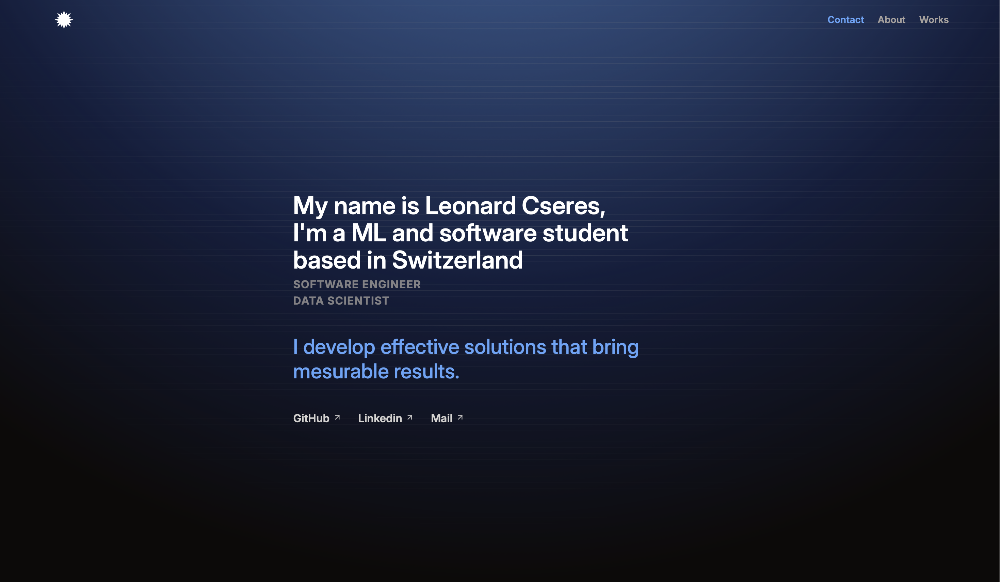

# Portfolio



My personal portfolio. Visit at [devleo.ch](https://devleo.ch)

## Technologies

- `Svelte`
- `Typscript`
- `Preline`
- and keeping it simple

## Developing

Once you've created a project and installed dependencies with `pnpm install` (or `npm install` or `yarn`), start a development server:

```bash
pnpm run dev
```

## Building

To create a production version the app:

```bash
pnpm run build
```

You can preview the production build with `pnpm run preview`.
